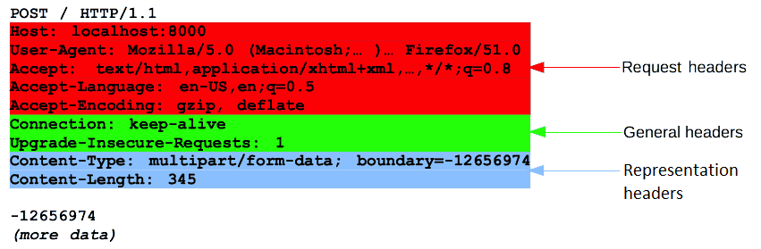

### Web Application
#### Local Environment Setup
<ul> 

What is IDE and why do we need IDE?

    <ul>
        <li>Integrated Development Environment</li>
        <li>Quickly navigating to a type without needing to worry about namespace, project etc</li>
        <li>Navigating to members by treating them as hyperlinks</li>
        <li>Autocompletion when you can't remember the names of all members by heart</li>
        <li>Automatic code generation</li>
        <li>Refactoring (massive one)</li>
        <li>Organise imports (automatically adding appropriate imports in Java, using directives in C#)</li>
        <li>Warning-as-you-type (i.e. some errors don't even require a compile cycle)</li>
        <li>Hovering over something to see the docs</li>
        <li>Keeping a view of files, errors/warnings/console/unit tests etc and source code all on the screen at the same time in a useful way</li>
        <li>Ease of running unit tests from the same window</li>
        <li>Integrated debugging</li>
        <li>Integrated source control</li>
        <li>Navigating to where a compile-time error or run-time exception occurred directly from the error details.</li>
    </ul> 

What is Java SE vs Java EE?

    <ul>
        <li>Java Platform, Standard Edition (Java SE) is a computing platform for development and deployment of portable code for desktop and server environments.</li>
        <li>Jakarta EE, formerly Java Platform, Enterprise Edition (Java EE) and Java 2 Platform, Enterprise Edition (J2EE) is a set of specifications, extending Java SE 8 with specifications for enterprise features such as distributed computing and web services. </li>
        <li>Java ME = Micro Edition. </li>
    </ul> 

What are differences between Java Development Kit(JDK) vs Java Runtime Environment(JRE)?

    <ul>
        <li>The JRE is the Java Runtime Environment. It is a package of everything necessary to run a compiled Java program, including the Java Virtual Machine (JVM), the Java Class Library, the java command, and other infrastructure. However, it cannot be used to create new programs.</li>
        <li>The JDK is the Java Development Kit, the full-featured SDK for Java. It has everything the JRE has, but also the compiler (javac) and tools (like javadoc and jdb). It is capable of creating and compiling programs.</li>
    </ul> 

What is a web browser and How does it work?

    <ul>
        <li>A web browser (commonly referred to as a browser) is a software application for accessing (locate, retrieve and display) information on the World Wide Web.</li>
        <li>As a client/server model, the browser is the client run on a computer that contacts the Web server and requests information. The Web server sends the information back to the Web browser which displays the results on the computer or other Internet-enabled device that supports a browser. </li>
    </ul> 

What is API testing? What is Postman and why we use it? 

    <ul>
        <li>API testing is a type of software testing that involves testing application programming interfaces (APIs) directly and as part of integration testing to determine if they meet expectations for functionality, reliability, performance, and security.</li>
        <li>Postman is a great tool when trying to dissect RESTful APIs made by others or test ones you have made yourself. It offers a sleek user interface with which to make HTML requests, without the hassle of writing a bunch of code just to test an API's functionality. </li>
    </ul> 

</ul> 

#### Web Application Basics

What's a web server? 

    <ul>
        <li>A web server is server software, or hardware dedicated to running this software, that can satisfy client requests on the World Wide Web. </li>
    </ul> 

<ul>

Client Server Architecture(Server vs Client) 

    <ul>
        <li>Client–server model is a distributed application structure that partitions tasks or workloads between the servers (providers of a resource or service) , and clients (service requesters). </li>
    </ul> 

Backend vs Frontend 

    <ul>
        <li>Front End Development: The part of a website that user interacts with directly is termed as front end. 
            <ul>
                <li>Front end Languages: HTML(Hyper Text Markup Language), CSS(Cascading Style Sheets), JavaScript. </li>
                <li>Front End Frameworks and Libraries: AngularJS/ React.js/ jQuery/ SASS </li>
            </ul>
        </li>
        <li>Backend Development: Backend is server side of the website. It stores and arranges data, and also makes sure everything on the client-side of the website works fine.
             <ul>
                 <li>Front end Languages: PHP/c++/java/python/js. </li>
                 <li>Front End Frameworks and Libraries: Express, Django, Rails, Laravel, Spring, etc. </li>
             </ul>
        </li>
    </ul> 

What is localhost? 

    <ul>
localhost is a hostname that refers to the current computer used to access it. It is used to access the network services that are running on the host via the loopback network interface. Using the loopback interface bypasses any local network interface hardware.
    </ul> 

</ul>

Network Protocols and OSI model 

    <ul>
        <li>Open Systems Interconnection model (OSI model) </li>
        <li> Application / Presentation / Session layer / Transport / Network / Data link / Physical layer </li>
    </ul> 

<ul>

TCP/IP 

    <ul>
        <li>Transmission Control Protocol (TCP) /  Internet Protocol (IP)  </li>
        <li>The Internet protocol suite is the conceptual model and set of communications protocols used in the Internet and similar computer networks. </li>
    </ul> 

<ul>

TCP vs UDP 

    <ul>
        <li> Transmission Control Protocol (TCP) is a connection-oriented protocol that computers use to communicate over the internet. It is one of the main protocols in TCP/IP networks. TCP provides error-checking and guarantees delivery of data and that packets will be delivered in the order they were sent. </li>
        <li> User Datagram Protocol (UDP) is a connectionless protocol that works just like TCP but assumes that error-checking and recovery services are not required. Instead, UDP continuously sends datagrams to the recipient whether they receive them or not. </li>
        <li> Similarity: They both work on the transport layer of the TCP/IP protocol stack and both use the IP protocol./li>
        <li> Difference: Connection and connectionless / Reliability / Flow control / Ordering / Speed</li>
        <li> Usage:
            <ul>
                <li> TCP - require high reliability where timing is less of a concern.</li>
                <li> UDP - require speed and efficiency</li>
            </ul>
        </li>
    </ul> 

 What is port?

    <ul>
        <li> a port is a communication endpoint. </li>
        <li> At the software level, within an operating system, a port is a logical construct that identifies a specific process or a type of network service. </li>
        <li> Identified for each transport protocol and address combination by a 16-bit unsigned number, known as the port number.</li>
        <Li> The most common transport protocols: TCP, UDP. </Li>
    </ul> 

</ul>

What’s HTTP? 

    <ul>
        <li> The Hypertext Transfer Protocol (HTTP) is an application layer protocol for distributed, collaborative, hypermedia information systems. </li>
        <li> </li>
    </ul> 

<ul>

HTTP 1.0 vs HTTP 1.1 vs HTTP 2.0 

    <ul>
        <li> 1989 / 1997 / 2015 </li>
    </ul> 

HTTP vs HTTPS 

    <ul>
        <li> HTTPS means that you tunnel the HTTP protocol over TLS/SSL which encrypts the HTTP payload.</li>
    </ul> 

</ul>

</ul>

What is an HTTP server and what does it do? 

    <ul>
        <li> HTTP Server AKA web server responds to requests from web browsers like firefox or chrome. </li>
        <li> The HTTP Server is the implementation of that protocol in a piece of Software.</li>
    </ul> 

HTTP messages 

    <ul>
        <li> HTTP messages are how data is exchanged between a server and a client. </li>
        <li> There are two types of messages: requests sent by the client to trigger an action on the server, and responses, the answer from the server.</li>
    </ul> 

<ul>

HTTP request methods(GET vs POST vs PUT) 

    <ul>
        <li> HTTP works as a request-response protocol between a client and server.</li>
        <li> GET is used to request data from a specified resource.</li>
        <li> POST is used to send data to a server to create/update a resource.</li>
        <li> PUT is used to send data to a server to create/update a resource.</li>
        <li> Difference btn POST and PUT: when calling multiple times, PUT has the same result, while POST creates the same resource multiple times. </li>
    </ul> 

 HTTP headers 

    <ul>
        <li> HTTP headers from a request follow the same basic structure of an HTTP header: a case-insensitive string followed by a colon (':') and a value whose structure depends upon the header. </li>
        <li> 
            <ul>
                <li> General headers, like Via, apply to the message as a whole.</li>
                <li> Request headers, like User-Agent, Accept-Type, modify the request by specifying it further (like Accept-Language), by giving context (like Referer), or by conditionally restricting it (like If-None).</li>
                <li> Representation metadata headers (formerly entity headers), like Content-Length that describe the encoding and format of the message body (only present if the message has a body).</li>
            </ul>
        </li>
    </ul> 
    

<ul>

 Content-Type header

    <ul>
        <li> The Content-Type entity header is used to indicate the media type of the resource. </li>
    </ul> 

 Access-Control-* header and CORS

    <ul>
        <li> Cross-Origin Resource Sharing (CORS) is an HTTP-header based mechanism that allows a server to indicate any other origins (domain, scheme, or port) than its own from which a browser should permit loading of resources. </li>
        <li> ??? </li>
    </ul> 

</ul>

 HTTP Status 

    <ul>
        <li> 1xx: Information </li>
        <li> 2xx: Successful </li>
        <li> 3xx: Redirection </li>
        <li> 4xx: Client Error </li>     
        <li> 5xx: Server Error</li>   
    </ul> 

 HTTP message body

    <ul>
        <li> HTTP Message Body is the data bytes transmitted in an HTTP transaction message immediately following the headers if there are any. </li>
        <li> The request/response message consists of the following:
            <ul>
                <li> Request line, such as GET /logo.gif HTTP/1.1 or Status line, such as HTTP/1.1 200 OK,</li>
                <li> Headers </li>
                <li> An empty line </li>
                <li> Optional HTTP message body data </li>
            </ul>
        </li>
    </ul> 

<ul>

 What’s JSON? 

    <ul> JSON (JavaScript Object Notation)
        <li> JSON is a language-independent data format. It was derived from JavaScript. </li>
        <li>  JSON filenames use the extension .json. </li>
    </ul> 

 JSON vs XML

    <ul> Extensible Markup Language (XML) is a markup language.
        <li> HTML displays data and describes the structure of a webpage, whereas XML stores and transfers data. </li>
        <li> HTML is a simple predefined language, while XML is a standard language that defines other languages.</li>
    </ul> 

</ul>
</ul>

 What’s URL?

    <ul> Uniform Resource Locator (URL)
    </ul> 

<ul>

 URL vs URI

    <ul> URI stands for Uniform Resource Identifier.
        <li> URL is a subset of URI that specifies where a resource is exists and the mechanism for retrieving it.</li>
        <li> A URI is a superset of URL that identifies a resource either by URL or URN (Uniform Resource Name) or both.</li>
    </ul> 

 URL format 

    <ul>
        <li> A scheme. (HTTP (without SSL) or HTTPS (with SSL))</li>
        <li> A host. Host names can also be followed by a port number.  </li>
        <li> A path.</li>
        <li> A query string.</li>
    </ul> 

</ul>

#### Apache Tomcat Server and Maven Project
Apache Tomcat Server [Wikipedia] [Official Website] [Source code]
HTTP server vs Application server [Link] [stackoverflow]
HTTP port vs AJP port [Official Website] [stackoverflow]
What is Server Location(aka CATALINA_HOME)? [stackoverflow]
Options other than Tomcat
Apache HTTP Server [Wikipedia] [Official Website]
Apache HTTP Server vs Apache Tomcat Server [Link]
Node.js [Wikipedia] [Official Website]
Node.js vs Java [Link]
Nginx [Wikipedia] [Official Website]
Nginx vs Tomcat [Link]
Maven Project
What is Maven and why do we need it? [Wikipedia] [Official website] [Quora]
Conventions of groupId, artifactId and version [Official Website] [stackoverflow]
Maven Archetypes [Official Link]
What’s the difference between Maven Build and Maven Install [stackoverflow]